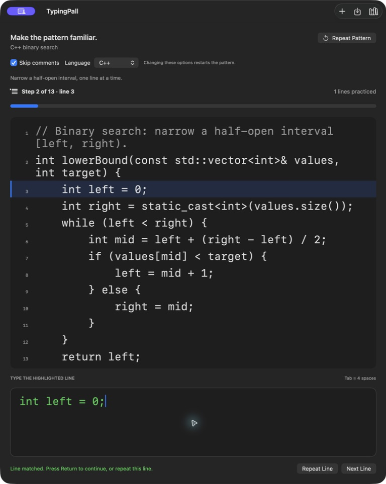
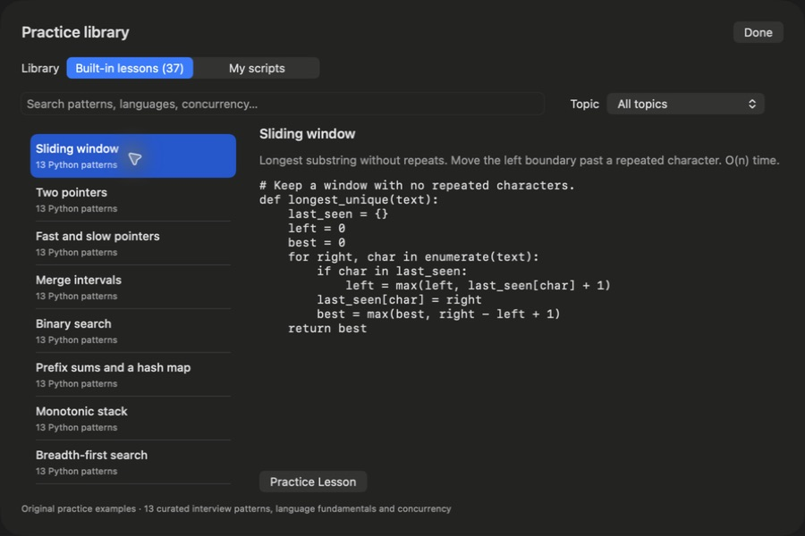

<div align="center">

# TypingPall

**Make code patterns familiar, one line at a time.**

A native macOS practice app for algorithms, low-level design, language idioms, and concurrency.

[](https://github.com/Mieraidihaimu/TypingPall/actions/workflows/run_tests.yml)

[](LICENSE)

[Get started](#get-started) · [Explore the lessons](#lessons-ready-to-practice) · [Contribute](CONTRIBUTING.md)

</div>

Reading an algorithm is one step. Writing it again helps you notice the details. TypingPall keeps a complete code pattern in view while you reproduce it line by line, correct differences, and repeat the parts you want to remember.

<p align="center">
  
</p>

## A small, focused practice loop

1. **Choose a pattern.** Open a built-in lesson, paste your own snippet, or import a source file.
2. **Type the line shown above the input.** Leading spaces and tabs are skipped automatically, and the first difference is underlined.
3. **Press Return to continue.** Repeat a tricky line or restart the entire pattern whenever you want. When you finish, the next lesson is one Return away.

To check whether you can spot a pattern before writing it, press **⇧⌘D**: the *Which pattern?* drill shows a short scenario, then the cues that identify the answer.

- **Built-in lessons in three tracks** (LeetCode, Low-level design, Languages & syntax) across Python, C++, Rust, and Go, with search and topic filters.
- **LeetCode and design patterns include recall notes** (cues, invariant, pitfalls, anchors, mantra), and library search matches the cues.
- **Practice from memory.** Key lines (⌘2) and Recall (⌘3) hide code, check each line when you press Return, offer one-token hints on request (⌘'), and grade the attempt without timing it.
- **Optional comment skipping** lets you focus on code while the full reference stays visible.
- **Your own practice library** stores imported and pasted patterns locally.
- **Calm progress** shows your place (2 of 13), with no timer or speed target.
- **Native and offline** with SwiftUI, AppKit, and Core Data. No account, analytics, or third-party runtime dependencies.
- **Comfortable input** with adjustable monospaced text, tab width, and an optional on-screen keyboard.

## Get started

The features shown here are on `main`. Build from source to try them; the [older 1.0.1 pre-release](https://github.com/Mieraidihaimu/TypingPall/releases/tag/1.0.1) predates this practice flow and lesson library.

On a Mac with full Xcode installed:

```sh
git clone https://github.com/Mieraidihaimu/TypingPall.git
cd TypingPall
open TypingPall.xcodeproj
```

Select the **TypingPall** scheme, choose **My Mac**, and press **⌘R**. The app targets macOS 12 or later; use a current Xcode to build it. If Xcode requests signing configuration, choose your development team under Signing & Capabilities.

Start with the C++ binary-search exercise, or press **⌘L** to pick a lesson. To practice your own code, use **Add Script** or **⌘O** to import a UTF-8 source file.

## Lessons ready to practice

| Track | Collection | Examples |
| --- | --- | --- |
| LeetCode | Python interview patterns | Sliding window, two pointers, binary search, BFS, DFS, tree and grid traversal, topological sort, backtracking, union-find, knapsack and other dynamic programming |
| Low-level design | Creational, structural and behavioral patterns | Factory, builder, singleton, adapter, decorator, composite, strategy, state, observer, command, chain of responsibility |
| Low-level design | Design building blocks | LRU cache, token-bucket rate limiter |
| Languages & syntax | Python fundamentals | Comprehensions, collections, generators, dataclasses |
| Languages & syntax | C++ fundamentals | Vectors, hash maps, ownership, lambda sorting |
| Languages & syntax | Rust fundamentals | Borrowing, `Result`, iterators, enums |
| Languages & syntax | Go fundamentals | Slices, errors, methods, interfaces |
| Languages & syntax | Concurrency across four languages | Thread pools, async tasks, mutexes, condition variables, channels |



Browse the original examples in [lessons.json](TypingPall/Content/lessons.json). Imported snippets are used as practice text; the app does not execute them.

## Shortcuts

| Action | Shortcut |
| --- | --- |
| Confirm the current line | Return |
| Copy, Key lines, Recall | ⌘1, ⌘2, ⌘3 |
| Hint | ⌘' |
| Repeat the pattern | ⌘R |
| Open the library | ⌘L |
| Which pattern? drill | ⇧⌘D |
| Import a file | ⌘O |
| Add a script | ⇧⌘N |

## A few useful details

Indentation remains visible in the reference, but leading spaces and tabs are excluded from the typing target. Internal and trailing spaces still count. Blank lines advance with Return, and the final line completes the pattern only after confirmation.

Imports accept UTF-8 files up to 1 MB and 20,000 normalized characters. Line endings are normalized, tabs expand to your configured width, and Unicode is preserved. The practice input accepts one line at a time; paste complete snippets into **Add Script**. Saved patterns survive relaunches; your current practice position does not.

Comment filtering supports Python, C++, Rust, and Go. Select **Plain text** for other languages, or turn off **Skip comments** in **Options** to practice the complete text. Changing an option mid-pattern keeps your place. Python docstrings stay in the exercise.

## Build and contribute

Bug reports, clearer lessons, accessibility improvements, and small fixes are welcome. Start with the [contribution guide](CONTRIBUTING.md), [report a bug](https://github.com/Mieraidihaimu/TypingPall/issues/new?template=bug_report.yml), or [suggest a lesson](https://github.com/Mieraidihaimu/TypingPall/issues/new?template=lesson_request.yml).

```sh
# Unit tests, UI tests, and an Apple silicon + Intel Release build
./scripts/check.sh

# Unit tests and the Release build, without desktop UI automation
./scripts/check.sh -only-testing:TypingPallTests

# Validate the bundled lesson examples with available language toolchains
python3 scripts/check_lessons.py
```

UI tests require a logged-in desktop and permission for the Xcode test runner to control it. See the [release guide](RELEASE.md) for distribution checks and the [documentation archive](docs/archive/README.md) for historical design notes.

If TypingPall earns a place in your practice routine, a star helps other developers find it.

Created by Mier, with thanks to [everyone who contributes](https://github.com/Mieraidihaimu/TypingPall/graphs/contributors). Licensed under [GPL-3.0](LICENSE).
